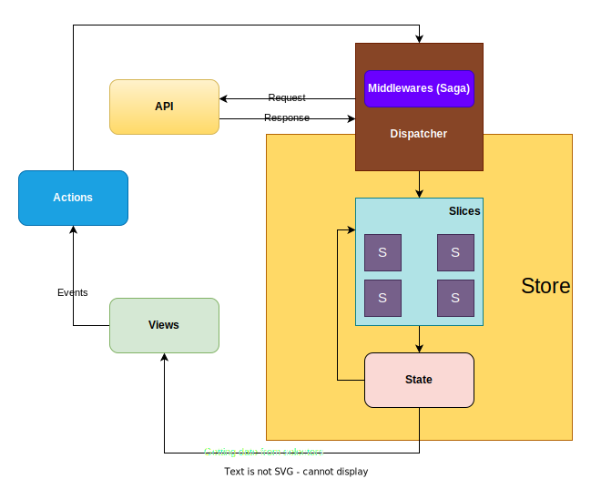

## How to run

Before anything else, you must have node installed on your machine.

## Install Dependencies
```bash
npm install
```

## Set the environment variables

```bash
cp sample.env .env

# open .env and modify the environment variables (if needed)
```
### Running Dev Server

Run on your terminal `npm run start`, the server will restart everytime you make a change in your code.

## Tech Stack

- [React](https://reactjs.org/), [React Router](https://reactrouter.com/), [Recoil](https://recoiljs.org/),
  [Emotion](https://emotion.sh/), [Material UI](https://next.material-ui.com/),
- [Rollup](https://rollupjs.org/),
  [ESLint](https://eslint.org/),
  [Prettier](https://prettier.io/), [Jest](https://jestjs.io/),
  [Yarn](https://yarnpkg.com/)
## Project Structure

```
src\
 |--config\                       # Contains all the configurations that are used across modules
    |--environment.js             # The environment related configurations that are referred from the .env file are added here
    |--index.js                   # All the configurations are included in the index.js file since the project is index based. This will make it easier to import into the cross modules
 |--modules\                      # Modules allow you to break up your code into separate files   
    |--common\                    # All the common modules which are used across modules are available here
       |--assets                  # All the images and fonts are stored here permission 
       |--components              # All the common components that are being used across modules (re-usable components) are available here
       |--constants               # All the constants applicable to the project eg: global routes, roles etc. are available here
       |--contexts                # All the context api related files are available here
       |--helpers                 # A helper class is used to assist in providing some functionality to another class
       |--hooks                   # Here we add all the custom hooks which are used throughout the application
       |--layouts                 # Includes all the common layouts (e.g.Auth layout, dashboard, etc...)
       |--middleware              # Access for requesting an object, responding to an object, and moving to the next middleware function in the application request-response cycle is managed here
       |--scss                    # All the application related scss files are available here
       |--static-data             # This is feature module for getting application common data
       |--style                   # Global styles are included here
       |--theme                   # Application theme related files are maintained here
       |--utils                   # All the utility functions and classes are maintained here  
       |--wrappers                # All the application theme wrappers are available here
    |--rest-modules               # All the rest modules in the application are maintained here 
 |--root-saga\                    # The root Saga aggregates multiple Sagas to a single entry point for the Saga middleware to run
    |--index.js                   # This file includes all the sagas
 |--routes                        # Route is the conditionally shown component that renders some UI when its path matches the current URL
    |--index.jsx                  # Includes the route configurations into the useRoute hook and add into the project
    |--router.jsx                 # The router configuration file is defined here
 |--store\                        # A store is basically just a plain JavaScript object that allows components to share state.
 |--App.jsx\                      # Initial point of the Application.
```

## Feature Structure
```
sign-in\
|--components\                    # The component is broken into smaller components which are only related to the particular module
    |--component-1                # Component one
       |--index.jsx               # The component functionality is written here 
       |--index.scss              # scss related to the particular component
       |--style.js                # style components related to the particular component
    |--component-2                # Component two
       |--index.jsx               # The component functionality is written here
       |--index.scss              # scss related to the particular component
       |--style.js                # style components related to the particular component
    |--index.js                   # All the configurations are included in the index.js file since the project is index based. This will make it easier to import into the cross modules
 |--validation\                   # All the validations related to sub components inside the module are stored here
 |--constants.js                  # The route structure is defined here
 |--saga.js                       # When a promise is run and yielded, the middleware suspends the saga until the promise is resolved. Once the promise is resolved the middleware resumes the saga, until the next yield statement is found. It is suspended again until it's promise is resolved 
 |--selectors.js                  # Access the data from the store according to the above components
 |--slice.js                      # Slice is a collection of reducer logic and actions for a single feature of the application
 ```
 
 ## Handle request module

The ```request.js``` file is available inside the ```/src/modules/common/utils```.  The request object has been generalized based on constant.js which is 
inside the common module.  The ```GET,POST,PUT,PATCH``` and ```DELETE``` methods are handled within the file. The data structure for each method is mentioned below.

- GET       # path param or query string are used
- POST      # Payload data
- PUT       # Payload data
- DELETE    # Path param
- PATCH     # Payload data

Eg :-

### Path param and query string
```
 GET_SELECTED_DEVICES_LIST: {
    path: '/organizations/:organizationId/devices?:query',
    method: 'GET'
  }
```
In order to pass a query string, ```query``` needs to be used as a key inside the json payload and the query string added as a value .
```
{query:"id=1&id=2",key1:"value",key2:"value",organizationId:"value"}
```
### Path param and payload
```
 POST_SELECTED_DEVICE_LOGS: {
    path: '/organizations/:organizationId/devices/device-logs',
    method: 'POST'
}
```
If there is a requirement to add a path param, the particular key will have to be included with ```:``` inside the constant (as described in the example above). In path param key should be the same in the json object that was input into the from the react component. The implementation inside frontend must be utilized in this manner.
```
dispatch(signInActions.signIn({organizationId:"value",payloadRestKey1:"value",payloadRestKey2:"value"}));
```

## A High-Level introduction to Redux Saga
Redux Saga is a middleware library used to allow a Redux store to interact with resources outside of itself asynchronously. This includes making HTTP requests to external services, accessing browser storage, and executing I/O operations. These operations are also known as side effects. Redux Saga helps to organize these side effects in a way that is easier to manage. [More about Saga](https://redux-saga.js.org/)

## Explain the request flow from component to the API


## React Hooks Lifecycle Diagram#


[More about the react hooks](https://reactjs.org/docs/hooks-reference.html)

## React Module rendering

